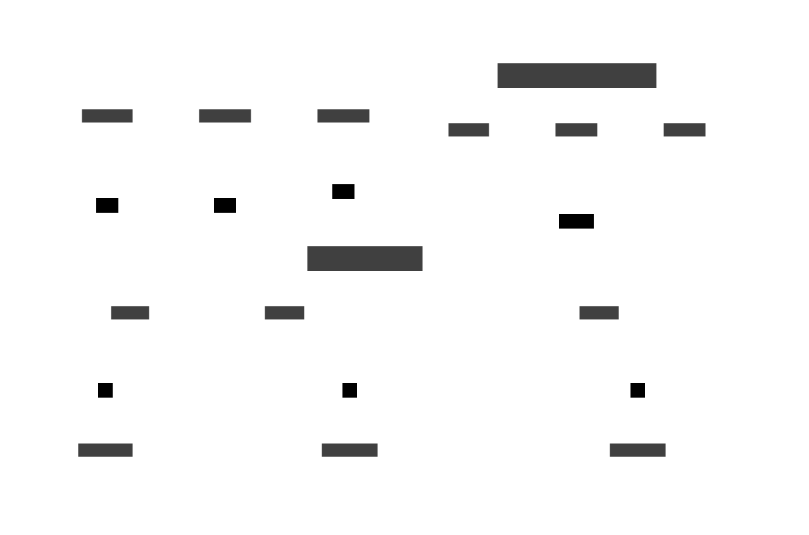

# _Gentle_ intro to Apache Kafka

---

## Agenda

- What Kafka is?
- How Kafka works?
- Key learnings
- Demoing

Note:

- Zero experience with Kafka in production
- Relevant experience with similar messaging technologies
- Much like SQS, ActiveMQ, RabbitMQ etc... for messaging

---

## What Kafka is?

----

### _Kafka is an event streaming platform_

> Event streaming is the digital equivalent of the human body's central nervous system. It is the technological
> foundation for the 'always-on' world where businesses are increasingly software-defined and automated, and where the
> user of software is more software.

_https://kafka.apache.org/documentation/#introduction_

Note:

- Event streaming ~ Digital Human nervous system
- Real-time data capture from mobile devices, sensors, databases, apps..
- Allows to react events at Real Time or Retrospectively

----

### Origins

- Originally developed at LinkedIn
- Open sourced ~2011
- Original devs created: https://www.confluent.io/

----

### Use cases

- Activity tracking
- Monitoring and metrics
- Log aggregation
- Stream processing
- Event sourcing
- Commit log
- **_Messaging_**

Note:

- Activity tracking: Think about Website page views..
- Monitoring: Think of operational data, health metrics..
- Log aggregation: Think of combining logs from multiple services
- Stream processing: Think of data pipelines.
    - Example: Crawling job ads from external site and publishing to topic. Having flows to re-define and import
- Event sourcing: Application state as time ordered sequence of records.
- Commit log:
    - Maintain state in distributed system
    - Similar to Apache BookKeeper

----

### Why messaging?

Messaging enables **loose coupling** and **message buffering** between distributed systems.

Note:

- Think of sending envelopes in real life
- Provided by products such as ActiveMQ, RabbitMQ, AWS SQS

----

### 

Note:

- Think what happens when receiver is not available?
- Think how sender locates the receiver?
- Napkin math: 5 services with success ratio of 0.999 call other 5 services => 2% total successful requests
- Amount of connections "explode"

----

### 

Note:

- Event driven architecture has a lot of benefits
- Allows processing events at own speed
- Avoid temporal coupling (both sides must be up at the same time)
- Ability to integrate without the producer/upstream knowing
- Load patterns become predictable to your service. Nobody just to call it with huge number of requests

----

### So what is it?

In short, capable and flexible technology, that can work as a **Message queue**, **Pub/Sub system**, **Real Time
Streaming platform** or because of its durable storage, even as a **Database**

---

## How Kafka works?

----

### Cluster Anatomy



Note:

- Zookeeper tightly integrated with Kafka until very recently
- Zookeeper manages the Kafka brokers in HA setup
- Recent Kafka versions support running with Zookeeper using Quorum controllers
- Quorum controllers keep the metadata about the cluster in Kafka itself
- https://developer.confluent.io/learn/kraft/

----

### Broker Anatomy


Note:

- Brokers have topics
- Topics have partitions
- Partitions have messages
- Producers produce to partitions
- Consumers pull from partitions

----

### Message

> Atomic unit of data in Kafka

- Also referred to as `Event` or `Record`
- Has _Headers_, _Value_ and optional _Key_

----

### Partition

> Where sent `Messages` actually end up

- `Messages` within are ordered
- `Messages` have a `Offset` number

Note:

- Enables many Kafka's scaling capabilities
- Partition setting will affect scalability (due groups)

----

### Topic

> A logical category of `Messages`

- Has 1..n `Partitions`
- Has only same type of data
- Has a unique, meaningful name
    - e.g. `public.announcement`

Note:

- Naming conventions have best practices, but can be anything.

----

### Producer

> Component that sends the `Messages`

- Decides the `Partition` within a `Topic`
- Decides the of `Delivery Guarantee` it needs
- Handles data serialization to the wire
    - JSON, Avro, Protobuf...

Note:

- Produce messages in binary format
- Key serializer and Value serializers are separate
- Modes: No key specified, Key specified, Partition specified, Custom partitioning logic

----

### Consumer

> Polling process that reads `Messages`

- Receives `Messages` from `Partitions`
- Commits current `Offset` back to Kafka
- Handles data deserialization

Note:

- Leverages message batching
- With Zookeeper offsets were sent there

----

### Consumer groups

> Multiple consumers as a logical unit

More about this in demo ...

----

### Broker

> A single Kafka server

Accepts message from `Producers`, assigns offsets to them and writes to `Partitions`

----

### Cluster

> A group of Kafka Brokers working together

- Provides Scalability, Availability and Fault tolerance
- Clustering allows to replicate `Partitions`
- `Brokers` act as `Leaders` and `Followers` for `Partitions`

Note:

- Replication factor of 3 => all messages live in three brokers

---

## Key learnings

----

### Message ordering

> Messages are guaranteed to be ordered in a single Partition, but not between Partitions of a Topic

----

### Partition allocation

> Producer will decide the partition where message lands

1. Based on message attribute
2. Based on message key
3. Using round-robin

Note:

- Partition specified in the record
- Partition not specified but record has a key
- Round-robin
- In key based distribution "murmur2" algorithm is used to hash the key

----

### Delivery guarantees

> Producer defines the level of guarantee it requires from the Broker

|||
|--|--
| ack=0 | Fire & forget
| ack=1 | Leader node confirms
| ack=all | All nodes confirm

----

> Exactly once delivery semantics is possible in Kafka with the help of transactions. Missing from many competing
> products.

|Delivery guarantee|Producer acks|Transactions
|--|--|--
| At most once | ack=0 | No
| At least once | ack=1, ack=all | No
| Exactly once | ack=1, ack=all | Yes

Note:

- Use case is important. Think of IoT sensor data vs. financial transactions
- Transactions allow storing the offsets and data in atomic operation

----

### Consumers use "pull" model

> By using offsets consumers can define the position from which to read messages

Consumer positions are maintained in a special topic called `__consumer.offsets` inside Kafka

Note:

- Consumers store offsets within Kafka, possible to store elsewhere as well.
- `enable.auto.commit=true` configures Consumers to automatically commit offsets.
- Consumers can decide to read whole history or only updates
- Consumers maintain current offsets in special Kafka topic

----

### Scalability with consumer groups

> Consumers join groups to consume messages in a large logical units

Note:

- Group guarantees only one consumer per partition
- Re-balancing happens when consumers come and go

----

### Kafka is really efficient

> 2 Million Writes Per Second (On Three Cheap Machines)...

-----

Why so fast?

- Minimal byte copying
- Minimal network overhead via batching
- Smart use of disk & kernel

Note:

- Producer, Broker and Consumer share a standardized binary message format. No additional data manipulation.
- Minimizing network round trips with effective batching
- Kafka is smart in how it writes to disk, it uses disk in favour of memory which fe
- https://andriymz.github.io/kafka/kafka-disk-write-performance/
- https://engineering.linkedin.com/kafka/benchmarking-apache-kafka-2-million-writes-second-three-cheap-machines

----

### Kafka is durable

> Technically only the disk space is the limiting factor of how much data can be saved

---

## Thanks!

> https://github.com/jrno/nodejs-kafka-intro

---

## Examples

```
import { Kafka } from 'kafkajs'

const kafka = new Kafka({
    clientId: 'simple-messaging-demo',
    brokers: [`localhost:9092`]
})
```

> https://github.com/jrno/kafka-intro/tree/master/examples

> https://kafka.js.org/

Note:

- https://docs.confluent.io/platform/current/clients/index.html
- Example with CLI
- Example With KafkaJS